# *Batch and Streaming Processing with Spark*

---

## **1.Cluster Setup (Hadoop + Spark)**

1. Prepare a Hadoop Docker image in `\hadoop-spark-cluster\docker-compose.yml`.
2. Start Hadoop Cluster (3 containers):

```
docker start hadoop-master hadoop-worker1 hadoop-worker2
```

3. Enter Master Container:

```
docker exec -it hadoop-master bash

```

   4.Download Spark inside Hadoop Master:

```
cd /opt
wget https://downloads.apache.org/spark/spark-3.5.0/spark-3.5.0-bin-hadoop3.tgz
```

  5.Extract Spark:

```
tar -xvzf spark-3.5.0-bin-hadoop3.tgz
mv spark-3.5.0-bin-hadoop3 spark

```

 6.Start Hadoop Services:

```
hdfs --daemon start namenode
hdfs --daemon start datanode
```

```
yarn --daemon start resourcemanager
yarn --daemon start nodemanager
```

7.Check running Java processes:

```
jps
```

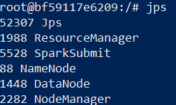

8.Test HDFS:

```
hdfs dfs -mkdir -p /user/root
hdfs dfs -ls /

```

---

## **2.Test Spark Shell with Batch**

1.Create a file inside master container:

```
echo "Hello Spark Wordcount! Hello Hadoop Also :)" > file1.txt

```

2.Upload the file to HDFS:

```
hdfs dfs -put file1.txt

```

3.Start Spark Shell:

-Set SPARK_HOME and update PATH:

```
export SPARK_HOME=/opt/spark
export PATH=$SPARK_HOME/bin:$PATH

```

```
spark-shell

```

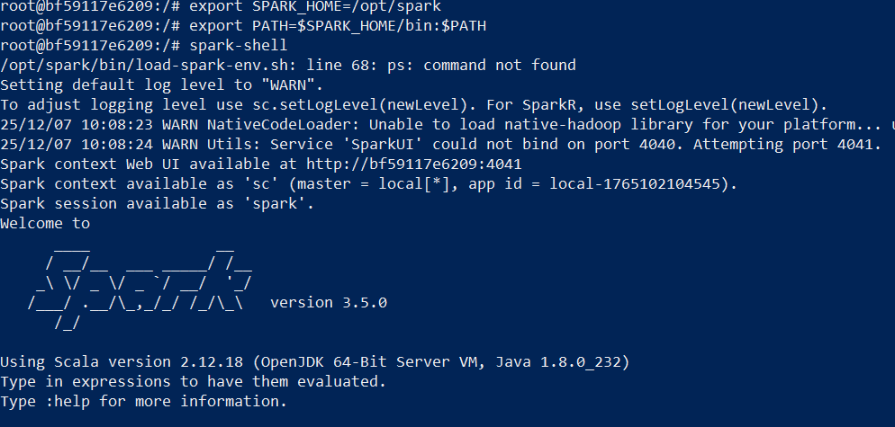

4.Run Simple WordCount (inside spark-shell):

```
val lines = sc.textFile("file1.txt")
val words = lines.flatMap(_.split("\\s+"))
val wc = words.map(w => (w, 1)).reduceByKey(_ + _)
wc.saveAsTextFile("file1.count")

```

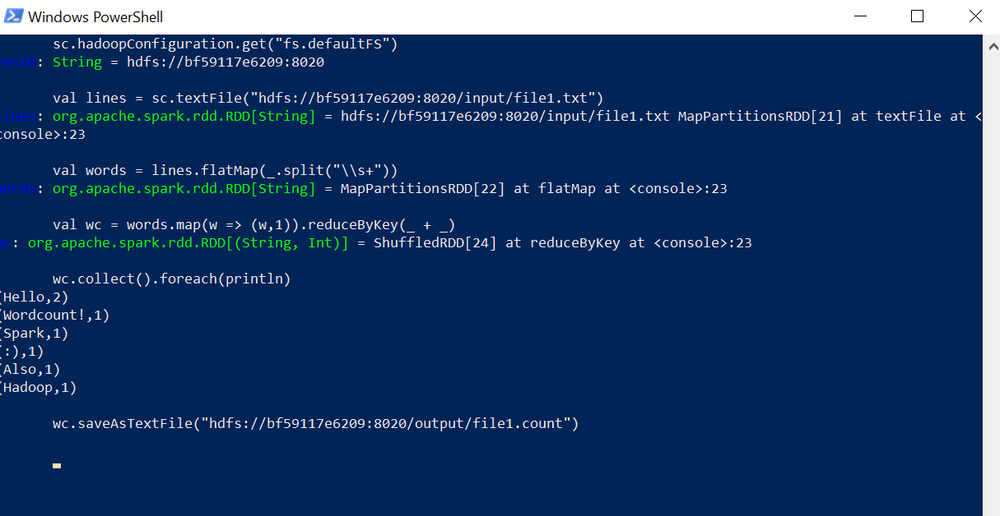

5.Display results:

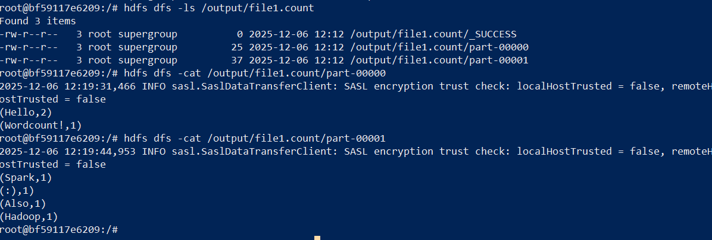

---

## 3.Spark Batch Project with Java

1.Create Maven Project:

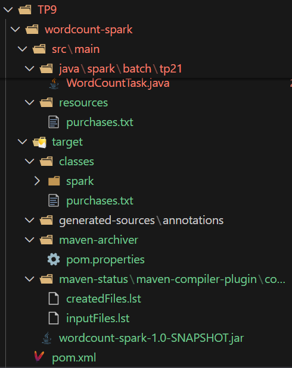

2.Add test file `purchases.txt`in `src/main/resources`:

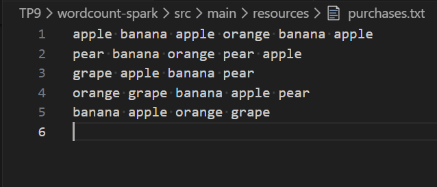

3.Build JAR:

```
mvn clean package
```

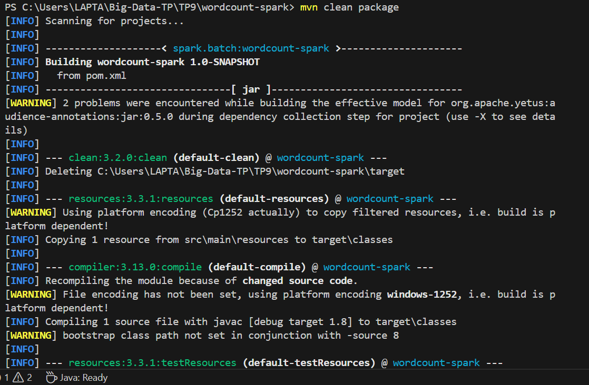

4.Copy JAR and `purchases.txt` to Hadoop Master:

```
docker cp target/wordcount-spark-1.0-SNAPSHOT.jar hadoop-master:/root/wordcount-spark.jar

```

```
docker cp "C:\Users\LAPTA\Big-Data-TP\TP9\wordcount-spark\src\main\resources\purchases.txt" hadoop-master:/root/purchases.txt
```

5.Run locally inside container:

```
/opt/spark/bin/spark-submit --class spark.batch.tp21.WordCountTask --master local wordcount-spark.jar input/purchases.txt out-spark

```

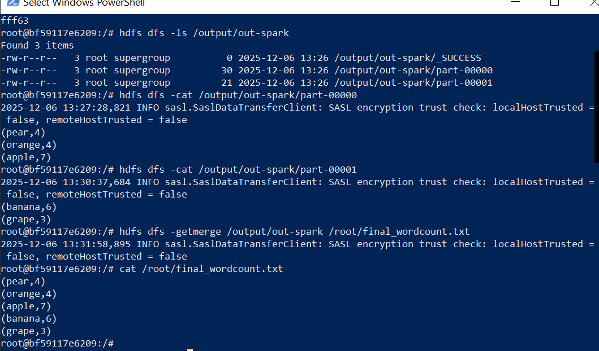

6.Run on YARN Cluster:

```
/opt/spark/bin/spark-submit --class spark.batch.tp21.WordCountTask --master yarn --deploy-mode cluster /root/wordcount-spark.jar input/purchases.txt out-spark2
spark-submit --class spark.batch.tp21.WordCountTask --master yarn --deploy-mode cluster wordcount-spark.jar input/purchases.txt out-spark2

```

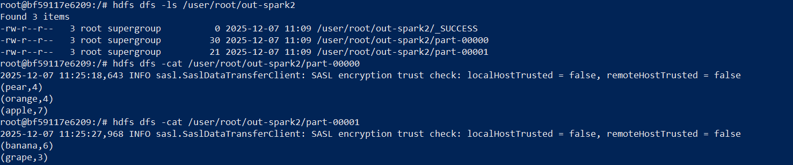

---

## 4.Spark Streaming Project

1.Create Maven Project:

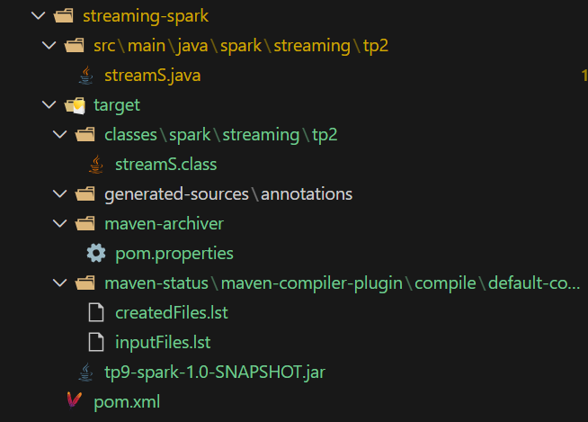

2.Build JAR:

```
mvn package

```

3.Copy JAR to Hadoop Master:

```
docker cp target/stream-1.0-SNAPSHOT.jar hadoop-master:/root/stream-1.jar

```

4.Install Netcat:

```
apt update && apt install netcat

```

5.Start Netcat (listening on port 9999):

```
nc -lk 9999

```

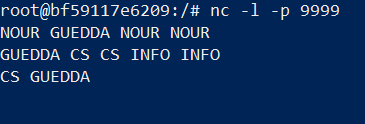

6.Run Spark Streaming:

```
/opt/spark/bin/spark-submit   --class spark.streaming.tp2.streamS   --master local[*]   /opt/tp9-spark-1.0-SNAPSHOT.jar
```

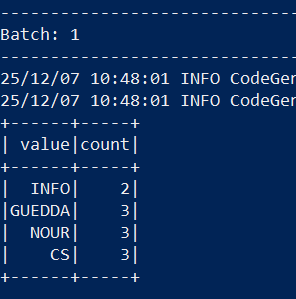
